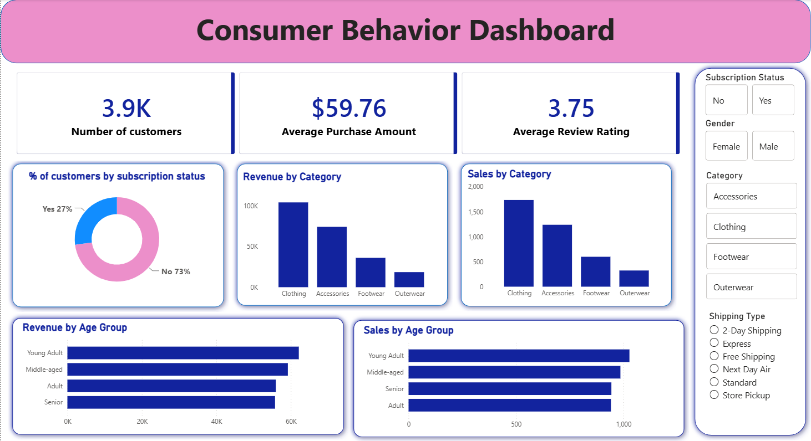
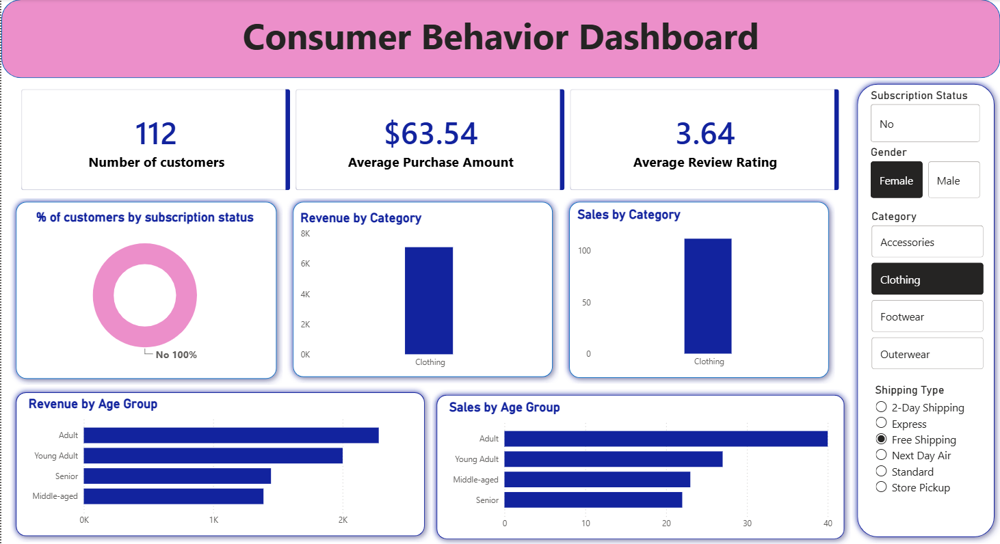

# 📊 Customer Behavior Analysis

An end-to-end data analytics project that analyzes customer shopping behavior to identify purchasing patterns, customer segments, product performance, and business opportunities using **Python, PostgreSQL, SQL, and Power BI**.


## 📌 Project Overview

Understanding customer purchasing behavior is essential for improving customer retention, optimizing product strategies, and making data-driven business decisions.

This project analyzes a customer shopping behavior dataset containing demographic information, purchasing history, product details, transaction information, discounts, subscriptions, and customer preferences.

The project follows an end-to-end analytics workflow:

**Data Cleaning → Exploratory Data Analysis → SQL Analysis → Power BI Dashboard → Business Insights**

## ⭐ Project Highlights

- Analyzed **3,900 customer records**
- Performed data cleaning and feature engineering using **Python/Pandas**
- Stored and queried analytical data using **PostgreSQL**
- Developed **10 business-focused SQL analyses**
- Used **CTEs, CASE statements, subqueries, aggregations, and window functions**
- Built an interactive **Power BI dashboard**
- Identified customer spending, loyalty, subscription, product, discount, and demographic patterns

## 🎯 Objectives

The main objectives of this project are to:

* Analyze customer purchasing patterns
* Identify high-value customer segments
* Understand product and category performance
* Analyze the impact of discounts and promotional offers
* Compare subscribed and non-subscribed customers
* Identify seasonal purchasing trends
* Analyze customer purchase frequency
* Build an interactive business intelligence dashboard
* Generate actionable business recommendations


## 📂 Dataset
**Dataset:** Customer Shopping Behavior Dataset

**Size:**

* 3,900 records
* 18 columns

### Key Attributes

| Category          | Attributes                                                      |
| ----------------- | --------------------------------------------------------------- |
| Customer          | Customer ID, Age, Gender, Location                              |
| Product           | Item Purchased, Category, Size, Color, Season                   |
| Transaction       | Purchase Amount, Review Rating                                  |
| Marketing         | Discount Applied, Promo Code Used                               |
| Customer Behavior | Subscription Status, Previous Purchases, Frequency of Purchases |
| Operations        | Shipping Type, Payment Method                                   |


## 🛠️ Technologies Used

### Programming & Analysis

* Python
* Pandas
* NumPy
* Matplotlib
* Seaborn
* Jupyter Notebook

### Database & SQL

* PostgreSQL
* SQL

### Visualization

* Microsoft Power BI
* DAX

### Other Tools

* Git
* GitHub


## 🔄 Project Workflow

### 1. Data Loading

The dataset was loaded into Python using Pandas.

Initial checks were performed to understand:

* Dataset dimensions
* Column names
* Data types
* Missing values
* Duplicate records
* Data consistency

### 2. Data Cleaning

The dataset was prepared for analysis by:

* Checking missing values
* Removing duplicate records
* Standardizing categorical values
* Correcting data types
* Preparing analytical fields

### 3. Exploratory Data Analysis

EDA was performed to understand:

* Customer demographics
* Purchase amount distribution
* Product category performance
* Seasonal purchasing behavior
* Customer purchasing frequency
* Subscription behavior
* Discount and promotional impact

### 4. SQL Analysis

The cleaned dataset was loaded into PostgreSQL for structured analytical querying.

The SQL analysis investigates areas such as:

* Revenue by category
* Average purchase amount
* Customer purchasing frequency
* Subscription vs. non-subscription behavior
* Discount impact
* Promotional code usage
* Customer segmentation

### 5. Power BI Dashboard

An interactive Power BI dashboard was created to provide a business-oriented view of the analysis.
## 📸 Dashboard Preview

### Dashboard Overview


### Interactive Filtered Analysis


### Dashboard includes:

* Total Revenue
* Average Order Value
* Product Category Performance
* Top-Selling Products
* Customer Segments
* Subscription Analysis
* Seasonal Trends
* Demographic Analysis
* Interactive filters and slicers

### Key Metrics

- Total Customers
- Average Purchase Amount
- Average Review Rating

### Analysis Areas

- Subscription behavior
- Revenue by category
- Sales by category
- Revenue by age group
- Sales by age group
- Customer demographics
- Shipping preferences

### Filters

The dashboard allows users to dynamically filter the analysis by:

- Subscription Status
- Gender
- Category
- Shipping Type

## Project Workflow

```text
Raw Customer Data
        ↓
Data Cleaning & Preprocessing
        ↓
Exploratory Data Analysis
        ↓
Feature Engineering
        ↓
PostgreSQL Database
        ↓
SQL Business Analysis
        ↓
Power BI Dashboard
        ↓
Business Insights & Recommendations

## 🔍 Key Business Insights

- **Revenue by Gender:** Male customers generated $157,890 in revenue compared with $75,191 from female customers, making male customers the larger revenue-contributing segment in this dataset.

- **Discounted Purchases:** 839 purchases received a discount while exceeding the overall average purchase amount, highlighting that discounted transactions were not limited to low-value purchases.

- **Shipping Behavior:** Customers using Express shipping had a higher average purchase amount ($60.48) than customers using Standard shipping ($58.46), a difference of approximately $2.02 per purchase.

- **Subscription Behavior:** Non-subscribers generated substantially more total revenue ($170,436) than subscribers ($62,645). However, non-subscribers also represent a much larger customer population (2,847 vs. 1,053), so the revenue difference should be interpreted alongside customer volume.

- **Customer Loyalty:** The dataset is dominated by loyal customers, with 3,116 customers classified as Loyal, compared with 701 Returning and 83 New customers. This indicates a strong concentration of customers with previous purchase activity.

- **Repeat Purchasing:** Among repeat buyers, 2,518 were non-subscribers and 958 were subscribers. This suggests that repeat purchasing occurs substantially outside the subscription program.

- **Discounting:** Hat had the highest discount rate at 50%, followed by Sneakers and Coat at 49%. Sweater and Pants also had relatively high discount rates of 48% and 47%, respectively.

- **Category-Level Product Demand:** Jewelry led the Accessories category with 171 orders, while Blouse and Pants each recorded 171 orders in Clothing. Sandals led Footwear with 160 orders, and Jacket led Outerwear with 163 orders.

- **Revenue by Age Group:** Young Adults generated the highest revenue at $62,143, followed by Middle-aged customers ($59,197), Adults ($55,978), and Seniors ($55,763). Revenue was relatively distributed across the age groups, with Young Adults contributing the most.


## 💡 Business Recommendations

Based on the analysis, the following actions could be considered:

1. **Focus on high-revenue customer segments**  
   Male customers generated the largest share of revenue in this dataset, suggesting an opportunity to understand their product preferences and purchasing behavior more deeply.

2. **Investigate subscription conversion opportunities**  
   Non-subscribers account for a much larger customer base and generate substantially more total revenue. Analyzing why repeat buyers remain unsubscribed could help identify opportunities for subscription conversion.

3. **Prioritize high-performing products**  
   Products such as Gloves, Sandals, and Boots achieved the highest average ratings, while several products also showed strong order volumes within their respective categories. These products could receive additional promotional or inventory attention.

4. **Evaluate discount effectiveness**  
   Products with high discount rates should be evaluated to determine whether discounts are increasing purchase volume sufficiently to justify the reduction in selling price.

5. **Target younger customer segments**  
   Young Adults generated the highest revenue among the analyzed age groups. Marketing campaigns and product recommendations could be evaluated for stronger engagement with this segment.


## 📁 Repository Structure

```text
CCustomer_Behavior_Analysis/
│
├── screenshots/
│   ├── dashboard_overview.png
│   └── dashboard_filtered_analysis.png
│
├── Consumer_Behavior_Analysis.sql
├── Consumer_Behavior_Dashboard.pbix
├── Consumer_Shopping_Behavior_Analysis.ipynb
├── customer_shopping_behavior.csv
├── Customer Shopping Behavior Analysis.pdf
├── Customer-Shopping-Behavior-Analysis.pptx
└── README.md
```


## ▶️ How to Run

### Python Analysis

Clone the repository:

```bash
git clone https://github.com/Kruti115/Customer_Behavior_Analysis.git
```

Install required Python libraries:

```bash
pip install pandas numpy matplotlib seaborn
```

Open the Jupyter Notebook:

```text
Consumer_Shopping_Behavior_Analysis.ipynb
```

Run the notebook cells sequentially.

### SQL Analysis

1. Install PostgreSQL.
2. Create a PostgreSQL database.
3. Import the cleaned dataset.
4. Open `Consumer_Behavior_Analysis.sql`.
5. Execute the queries.

### Power BI

Open:

```text
Consumer_Behavior_Dashboard.pbix
```

using Power BI Desktop.


## 📊 Project Deliverables

* Python EDA notebook
* PostgreSQL SQL analysis
* Interactive Power BI dashboard
* Analytical report
* Project presentation


## 🛠️ Skills Demonstrated

### Python
- Data cleaning and preprocessing
- Exploratory Data Analysis (EDA)
- Feature engineering
- Data visualization
- Pandas and NumPy

### SQL & PostgreSQL
- Aggregation and grouping
- Filtering and sorting
- Subqueries
- CASE statements
- Common Table Expressions (CTEs)
- Window functions
- Business-oriented SQL analysis

### Power BI
- Interactive dashboards
- KPI development
- Slicers and filters
- Data visualization
- Business insight presentation

### Tools
- Jupyter Notebook
- PostgreSQL / pgAdmin 4
- Power BI
- Git & GitHub


## 👩‍💻 Author

**Kruti Gupta**

GitHub: https://github.com/Kruti115

LinkedIn: https://www.linkedin.com/in/kruti-gupta-data/
